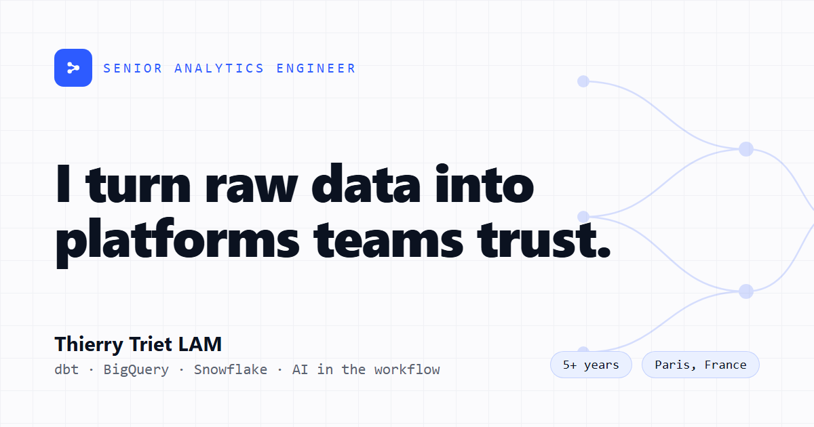

<!--
  CV-SYNC | CV source of truth: c:/Users/lammi/endeavor/en.tex (EN), c:/Users/lammi/endeavor/fr.tex (FR).
  CV-SYNC | This file repeats CV facts. Edit the .tex first, then propagate here.
  CV-SYNC | Full propagation list: search CV-SYNC-REGISTRY inside either .tex file.
-->

# Thierry Triet LAM — Portfolio

A fast, static, single page portfolio for a Senior Analytics Engineer and Data Platform Specialist. It answers four questions in under ten seconds: who I am, what I build, proof, and how to reach me.

**Live:** [thierrylam.fr](https://thierrylam.fr)



## What it is

One page, sticky anchor navigation, light and dark themes, built for speed and SEO. The visual identity is a well architected data platform expressed as a page: calm, precise, with a faint lineage graph as the signature, the same DAG that dbt and Airflow produce.

The work is shown in two layers. **Case studies** name the client and the impact. **Projects** are real work, anonymized and told as data stories, with charts and a method explained step by step.

## Highlights

* **Single page, zero runtime JavaScript by default.** Astro ships static HTML, so it loads fast and ranks well.
* **Data driven content.** Every fact lives in a typed data file or a markdown file. Editing the site is a one line change.
* **A Projects content collection.** Each project is one markdown file with its own page at `/projects/<slug>`. It scales without touching the layout.
* **Two featured data stories.** A B2B SaaS sales attainment analysis where the reporting grain decides the answer, and a mobile game build quality read where one broken level decides the rollout. Both run on synthetic data.
* **Company trust band.** Real logos, most recent mission first, each linking to the company site.
* **An interactive footprint map.** 9 companies across 4 countries and 35 countries traveled, on an inline world map with hover tooltips (built from `@svg-maps/world`, CC BY 4.0).
* **Bilingual.** English at `/` and French at `/fr/`, with a language switcher, localized SEO, and `hreflang`. The French content tracks the CV, and the CV downloads in either language regardless of the site language.
* **Light and dark themes** with no flash on load, full keyboard focus, alt text on every image, and reduced motion respected.
* **Deploys itself.** Push to `main` and GitHub Actions builds and publishes to GitHub Pages.

## Tech stack

Astro, Tailwind CSS, TypeScript, astro-icon (Lucide and Simple Icons), self hosted Fontsource fonts (Space Grotesk, Inter, JetBrains Mono), astro-seo, and a sitemap. Charts are hand coded SVG generated by a small Python script, no chart library.

## Featured projects: the data stories

**Which salespeople missed their target?** A B2B SaaS sales team beat plan overall, yet three reps quietly missed their number. The piece rebuilds five raw CRM exports into a tested, reproducible warehouse and finds the misses by reporting at the grain where targets actually live. The data is synthetic and mirrors a real engagement. Read it at `/projects/b2b-saas-sales-attainment`.

**Is the new build safe to ship?** A mobile game studio ran two builds side by side, and the new one loses a third of its day 7 players. The piece turns two raw event exports into a reproducible DuckDB + Python verdict, corrects the censoring trap that nearly doubles the apparent damage, and traces the whole loss to a single broken level. The data is synthetic and mirrors a real engagement. Read it at `/projects/mobile-game-build-quality`.

## Run it locally

You need Node 20 or newer.

```bash
npm install      # install dependencies
npm run dev      # dev server at http://localhost:4321
npm run build    # production build into dist/
npm run preview  # serve the built site locally
```

Generated assets (the CV PDFs, the social image, the project charts and the world map) are pre built and committed under `public/`, so the npm commands above are all you need.

## Project structure

```
public/        static assets: the CV, the photo, company logos, project charts
src/
  data/        typed content: identity, skills, case studies, demos, timeline
  content/     the Projects collection (one markdown file per project)
  components/  one focused component per section
  layouts/     the HTML shell, head, SEO, theme
  pages/       the homepage and the project detail route
  styles/      the global styles and the data story prose
```

## Deployment

Hosted on GitHub Pages through GitHub Actions. The repository is named `thierrytrietlam.github.io`, so the site serves at the root. Every push to `main` rebuilds and redeploys.

## Contact

Thierry Triet LAM, Senior Analytics Engineer, Paris. [LinkedIn](https://www.linkedin.com/in/thierrytrietlam) · [GitHub](https://github.com/thierrytrietlam) · thierrylam.aifr@gmail.com
